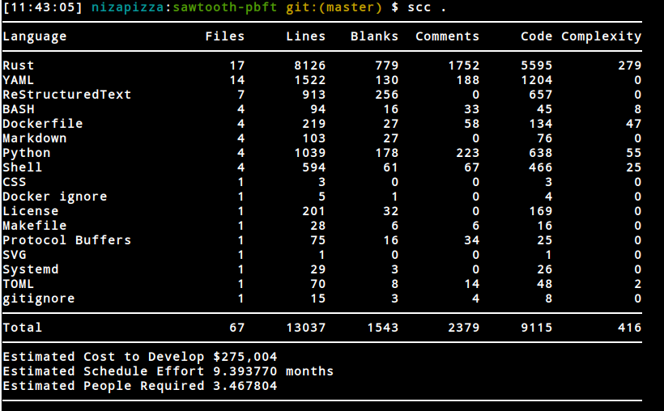
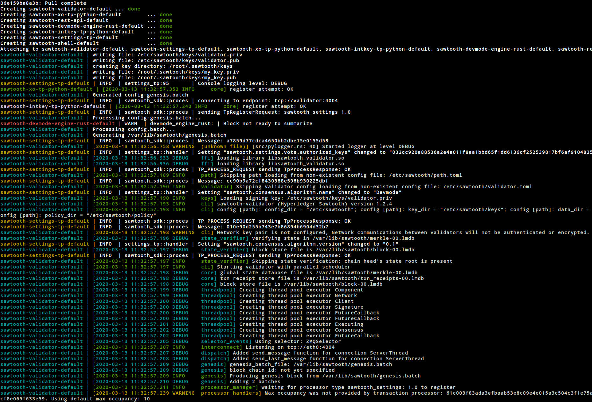

# read this

potential project

aa write a framework that tests the transaction processors


- [Certcoin](https://courses.csail.mit.edu/6.857/2014/files/19-fromknecht-velicann-yakoubov-certcoin.pdf) 
- [Decentralized PKI](https://medium.com/hackernoon/decentralized-public-key-infrastructure-dpki-what-is-it-and-why-does-it-matter-babee9d88579)

- [DigiNotar incident](https://en.wikipedia.org/wiki/DigiNotar)
- [Trustwave incident](https://en.wikipedia.org/wiki/Trustwave_Holdings)
- [Certificate Transparency google](https://www.certificate-transparency.org/)
- [Namecoin - Decentralized DNS](https://www.namecoin.org/)
- [Zero knowledge proof](https://en.wikipedia.org/wiki/Zero-knowledge_proof)
- [bitcoin armory](https://www.bitcoinarmory.com/)

# notes to myself

- transactions act as an incentive for miners to include information on the block.
- allthough, much of that is based on speculation. Naked money talks about it in one of its chapters.
- digital signatures can ensure that a new public key can only be posted by the holder of the secret key. Signatures and smart contract have that in common conceptually.

## zero knowledge proof

- there are interactive and non-interactive zero-knowledge proofs
- ali baba cave example, zero proofs in the mathematical send of the term because there is a small probability, the soundess error.
- computationally indistinguishable given an auxiliary string between verifier and prover
- Secure remote password has a zero-knowledge
- Find a [hamiltonian](https://en.wikipedia.org/wiki/Hamiltonian_path) for a large graph is considered infeasible and is NP complete.


## Data structures and algorithms


- [Np complete](https://en.wikipedia.org/wiki/NP-completeness)
- [Decision problem](https://en.wikipedia.org/wiki/Decision_problem)
- [merkle tree](https://en.wikipedia.org/wiki/Merkle_tree)
- [merkle trees in eth](https://blog.ethereum.org/2015/11/15/merkling-in-ethereum/)
- [merkle patricia tree](https://github.com/ethereum/wiki/wiki/Patricia-Tree)
- [Bloom filter](https://en.wikipedia.org/wiki/Bloom_filter)
- [merkle radix](https://medium.com/codechain/modified-merkle-patricia-trie-how-ethereum-saves-a-state-e6d7555078dd)


## Probability notes

- this happens when there is an attack [Gambler ruin](https://en.wikipedia.org/wiki/Gambler%27s_ruin)
- [Gambler's falacy](https://en.wikipedia.org/wiki/Gambler%27s_fallacy)
- [Random walks](https://en.wikipedia.org/wiki/Random_walk)


## About sawtooth


### differences between fabric and sawtooth

- fabric only supports permissioned
- fabric has fine-grained governance over participation

- sawtooth supports permissioned and permissionless blockchain network
- sawtooth defines roles and permissions which make it more flexible than fabric and auth is handled by validators in the network.


- ledger
- distributed
- secure

It's divided in two main layers
- app layer : this one can be anything

smart contracts virtual machine or a Business logic that is native to the problem.

- core layer


## Transactions


### Batches

contain multiple transactions. (in bitcoin transactions are atomic).
the header is the thing that gets signed


- validator makes sure the hash : payload_sha512 is the same as the payload. to make sure that no one changed the contents of the payload.
- public keys of both signer of batch and signer of transaction, prevents different transaction in different batch.
- family_name and family_version: routing information, to which transaction processors should I send this tx.
- inputs and outputs: addresses of state that we will be writing to (client needs to understand the same logic as tp. they kind of need to agree on how to calculate those addresses in that way the validator will do a better job in parallelizing the job).
- dependencies: other transactions that we need to wait on, not in the same batch

- the client encodes the data in a payload. the tp needs to decoded and it will encode some stuff in state
- the client needs to decode the data in state.
- 70 hex chars to  play with , first 6 name space of transaction family. 64 whatever you want ( a hash of a UUID ).
- with the merkle tree you can fetch anything under a prefix. anything that matches the namespace prefix. (you can create subname spaces).


the transactions go through these transaction processors for their unique requirements.

- Transaction processors sdks: python, javascript, go, c++, java and rust.
- these validators communicate with external things through standard HTTP/JSON.
- advanced parallel scheduler that splits transactions into parallel flows.
- we are preventing double spending obviously

- they are always wrapped in a batch, then submitted to the nodes to change the global state of the chain.
- batches are the unit of state change not transactions
- txs are wrapped inside of batches
- serialization is important, otherwise when the nodes (validators), some would consider them to be valid and some would not consider them valid, investigate the potential effects of that. 
- for serializing, look into [protocol buffers](https://developers.google.com/protocol-buffers)
- secp256k1 curve and ECDSA key using that curve, read into that.
- journal system, blockPublisher and chainController for block validation and fork resolution.
- use the original header bytes for verification. don't deserialize and reserialize, any deviation can break things. stick to reading the original header bytes and verify them before pushing them again
- normalization [Bitcoin Transaction Malleability](https://eklitzke.org/bitcoin-transaction-malleability)


## Events

- sawtooth can create and broadcast event.
- Subscriptions are done over a [ZMQ Socket](https://zeromq.org/socket-api/)


## Smart contracts


The transaction process kind of acts as a smart contract

you can have both TPs + smart contracts.
easy logic = tp 
unsusual logic = smart contract


Supply chain : talks directly to validator
Local database: redundancy

client = create transactions and batches and submit them. anything really. mobile cli web whatever either through the built-in rest or like supply chain approach


- [Seth](https://zeromq.org/socket-api/) allows to deploy EVM smart contracts onto Sawtooth
- [Sabre](https://sawtooth.hyperledger.org/docs/sabre/releases/latest/sabre_transaction_family.html)


## Consensus

- [General consensus stuff](https://www.hyperledger.org/blog/2018/11/09/hyperledger-sawtooth-blockchain-security-part-one)

- [Raft](https://sawtooth.hyperledger.org/docs/raft/nightly/master/introduction.html)

- [Original PBFT](https://www.usenix.org/legacy/events/osdi99/full_papers/castro/castro_html/castro.html)

- [PoET](https://sawtooth.hyperledger.org/docs/core/releases/latest/architecture/poet.html)
- [PBFT](https://sawtooth.hyperledger.org/docs/pbft/releases/latest/introduction-to-sawtooth-pbft.html)

- [Papertrail articles about consensus](https://www.the-paper-trail.org/tags/consensus/)

- Dynamic consensus.
- read about consensus [here](https://101blockchains.com/consensus-algorithms-blockchain/)
- Poet can be run with [SGX](https://en.wikipedia.org/wiki/Software_Guard_Extensions)

### Difference between Poet SGX and normal Poet

- with Poet SGX, you get hardware assistance which means you can achieve BFT that POW gives you if you have Intel chips
- normal Poet, you ensure Crash fault tolerance not Byzantine fault tolerance (all data is correct, can't ensure bad actors).


### PBFT

*The algorithm does not rely on synchrony to provide
safety. Therefore, it must rely on synchrony to provide
liveness; otherwise it could be used to implement
consensus in an asynchronous system, which is not
possible*


*It is not feasible to offerfault-tolerant privacy
in the general case because service operations may
perform arbitrary computations using their arguments and
the service state; replicas need this information in the
clear to execute such operations efficiently*

uses a round robin simple scheduler.

## Metrics

Sawtooth uses InfluxDb to store metrics data. That data gets fed then to grafana. An alternative technology to that would be Prometheus. It uses a pull system instead of a push and is maybe more performant.  


## note about transactions payloads

```

For example, the ‘inc’ and ‘dec’ transactions must list the initial ‘set’ transaction for the entry. If an ‘inc’ or ‘dec’ transaction is ordered before the corresponding ‘set’ transaction (without listing the ‘set’ transaction as a dependency), they will be considered invalid (because Name will not exist when they are processed).

```

# Security and Privacy


Hyperledger fabric uses a channel method as well as R3 Corda's and JPMorgan Quorom. through separation of concerns:
The key disadvantage of this model is that
it creates a number of ‘sub-chains’ and transferring assets between these chains adds
significant complexity or reduces confidentiality

# Offchain topics

- [eth alliance off chain trusted compute specs](https://entethalliance.github.io/trusted-computing/spec.html#conformance)


UTXO are unspent transaction outputs. 

When off-Ledger, the assets are represented as a document. This document holds the details of the assets. The sha512 hash of this document is the UTXO handle. In this case, the document is in a very real sense the asset that is being represented. Having access to the document will provide the details of the asset and who owns it. As such, it is important that the document is kept secret and protected. UTXODocument is considered valid when there is a matching UTXO record in the DLT. If there is not a matching entry in the DLT then the Asset has either been consumed or has not yet be recorded with Convert to UTXO or Transfer UTXO transactions.


# Sample applications

- Supply chain (tracking telemetry, goods logistics)
- Marketplace (asset exchange)


# Code analysis





## Starting a single node environment


Docker containers overview

```
CONTAINER ID        IMAGE                                            COMMAND                  CREATED             STATUS              PORTS                              NAMES
7aff0b07f31c        hyperledger/sawtooth-shell:chime                 "bash -c 'sawtooth k…"   12 minutes ago      Up 12 minutes       4004/tcp, 8008/tcp                 sawtooth-shell-default
46daf836f0b1        hyperledger/sawtooth-devmode-engine-rust:chime   "devmode-engine-rust…"   12 minutes ago      Up 12 minutes                                          sawtooth-devmode-engine-rust-default
418eb0e0b694        hyperledger/sawtooth-intkey-tp-python:chime      "intkey-tp-python -v…"   12 minutes ago      Up 12 minutes       4004/tcp                           sawtooth-intkey-tp-python-default
33756075952e        hyperledger/sawtooth-settings-tp:chime           "settings-tp -vv -C …"   12 minutes ago      Up 12 minutes       4004/tcp                           sawtooth-settings-tp-default
a79044b9b475        hyperledger/sawtooth-rest-api:chime              "sawtooth-rest-api -…"   12 minutes ago      Up 12 minutes       4004/tcp, 0.0.0.0:8008->8008/tcp   sawtooth-rest-api-default
1f540d690033        hyperledger/sawtooth-xo-tp-python:chime          "xo-tp-python -vv -C…"   12 minutes ago      Up 12 minutes       4004/tcp                           sawtooth-xo-tp-python-default
32bd01887eee        hyperledger/sawtooth-validator:chime             "bash -c 'sawadm key…"   12 minutes ago      Up 12 minutes       0.0.0.0:4004->4004/tcp             sawtooth-validator-default

``` 

Initial outputs




```

{
   "header":{
      "signer_public_key":"032cc920a88536a2e4a011f8aa1bbd65f1dd6136cf252539817bf6af9104835239",
      "transaction_ids":[
         "07d274ee533882af479bb4fe751e35c07250f3c4a2f840dda4d35e5173621e7e0819b7b418f8b6a3ddd27a62d33d6cbff0a25ece01e61a75ad33d73713674bf4"
      ]
   },
   "header_signature":"4663f9969f8ffca7671f3614aac63a2121c7167ef79545dd8db2b8a35060c02b6339da23c19187c5adfa1c68f51b5b7a2c288d12f2bf44754b4e3e19ef769f8a",
   "trace":false,
   "transactions":[
      {
         "header":{
            "batcher_public_key":"032cc920a88536a2e4a011f8aa1bbd65f1dd6136cf252539817bf6af9104835239",
            "dependencies":[

            ],
            "family_name":"sawtooth_settings",
            "family_version":"1.0",
            "inputs":[
               "000000a87cb5eafdcca6a8cde0fb0dec1400c5ab274474a6aa82c1c0cbf0fbcaf64c0b",
               "000000a87cb5eafdcca6a8cde0fb0dec1400c5ab274474a6aa82c12840f169a04216b7",
               "000000a87cb5eafdcca6a8cde0fb0dec1400c5ab274474a6aa82c1918142591ba4e8a7",
               "000000a87cb5eafdcca6a8cde0fb0dec1400c5ab274474a6aa82c12840f169a04216b7"
            ],
            "nonce":"",
            "outputs":[
               "000000a87cb5eafdcca6a8cde0fb0dec1400c5ab274474a6aa82c1c0cbf0fbcaf64c0b",
               "000000a87cb5eafdcca6a8cde0fb0dec1400c5ab274474a6aa82c12840f169a04216b7"
            ],
            "payload_sha512":"67e831a4896b7200c23df514393cfa7d3c5294328cd4717561d7bb8e0e70605310602326e2028be20f36c39e034839eefdd2abe18e9a78f6979753afadddabf6",
            "signer_public_key":"032cc920a88536a2e4a011f8aa1bbd65f1dd6136cf252539817bf6af9104835239"
         },
         "header_signature":"07d274ee533882af479bb4fe751e35c07250f3c4a2f840dda4d35e5173621e7e0819b7b418f8b6a3ddd27a62d33d6cbff0a25ece01e61a75ad33d73713674bf4",
         "payload":"CAESfwomc2F3dG9vdGguc2V0dGluZ3Mudm90ZS5hdXRob3JpemVkX2tleXMSQjAzMmNjOTIwYTg4NTM2YTJlNGEwMTFmOGFhMWJiZDY1ZjFkZDYxMzZjZjI1MjUzOTgxN2JmNmFmOTEwNDgzNTIzORoRMHhmM2RmOTI3NmM3YjcwYjc="
      }
   ]
}

```

If you go to the scripts folder you'll find a simple script that shows how to decoded a cbor payload using the cbor python package.  

now if you interact directly with the sawtooth tool you only get the cbor back but when requesting from the REST API they first encoded in base64 encoding then you can decode it to cbor format


# Small bank 

1. run multiple instances of the containers
2. try to run the smallbank transaction processor in this network and see how it works.

NOTE TO SELF: instead of going to github looking for the Dockerfile directly. go to [hyperledger's dockerhub](https://hub.docker.com/u/hyperledger/)

[Online transanction processing](https://en.wikipedia.org/wiki/Online_transaction_processing). Interesting read this

[HStore website](https://hstore.cs.brown.edu/). They are behind the smallbank-tp. It's mainly used for testing and benchmarking purposes.

so for each Transaction processor, we need to write a client that handles that encoding and serialization and sends it to the REST API.


so if we are writing the client we need the PROTO compiler to compile the .proto files so that we can use them to serialize the stuff properly

[Python grpc](https://grpc.io/docs/quickstart/python/). they use different tools to compile their protobuffs. documentation is really weird


# How to do the performance load on the small banking

```
smallbank-workload playlist create --accounts 1000 -n 100000 -o smallbank.playlist

smallbank-workload playlist process -i smallbank.playlist -k ~/.sawtooth/keys/mykey.priv -o smallbank.txns

smallbank-workload batch -i smallbank.txns -k ~/.sawtooth/keys/mykey.priv --max-batch-size 10 -o smallbank.batches

smallbank-workload submit -i smallbank.batches -r 10 --target http://10.0.2.81:8008


```

# Important

basically the addressing that is in the wiki is actually wrong (suggest a fix maybe later to them. this is super cryptic)
use the addressing schema from this repo instead of the one in the wiki.


# After that try to check the wallet repo, and see how different it is

[simple wallet](https://github.com/askmish/sawtooth-simplewallet)


