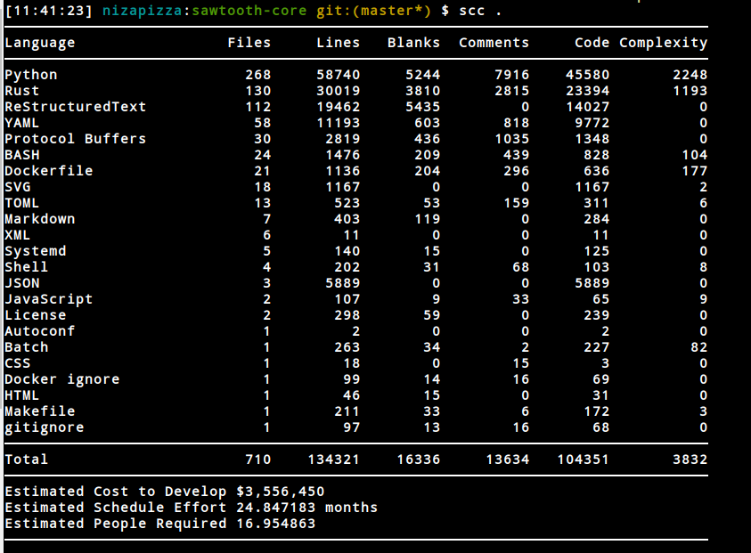

# read this

- [Certcoin](https://courses.csail.mit.edu/6.857/2014/files/19-fromknecht-velicann-yakoubov-certcoin.pdf) 
- [Decentralized PKI](https://medium.com/hackernoon/decentralized-public-key-infrastructure-dpki-what-is-it-and-why-does-it-matter-babee9d88579)

- [DigiNotar incident](https://en.wikipedia.org/wiki/DigiNotar)
- [Trustwave incident](https://en.wikipedia.org/wiki/Trustwave_Holdings)
- [Certificate Transparency google](https://www.certificate-transparency.org/)
- [Namecoin - Decentralized DNS](https://www.namecoin.org/)
- [Zero knowledge proof](https://en.wikipedia.org/wiki/Zero-knowledge_proof)
- [bitcoin armory](https://www.bitcoinarmory.com/)

# notes to myself

- transactions act as an incentive for miners to include information on the block.
- allthough, much of that is based on speculation. Naked money talks about it in one of its chapters.
- digital signatures can ensure that a new public key can only be posted by the holder of the secret key. Signatures and smart contract have that in common conceptually.

## zero knowledge proof

- there are interactive and non-interactive zero-knowledge proofs
- ali baba cave example, zero proofs in the mathematical send of the term because there is a small probability, the soundess error.
- computationally indistinguishable given an auxiliary string between verifier and prover
- Secure remote password has a zero-knowledge
- Find a [hamiltonian](https://en.wikipedia.org/wiki/Hamiltonian_path) for a large graph is considered infeasible and is NP complete.


## Data structures and algorithms


- [Np complete](https://en.wikipedia.org/wiki/NP-completeness)
- [Decision problem](https://en.wikipedia.org/wiki/Decision_problem)
- [merkle tree](https://en.wikipedia.org/wiki/Merkle_tree)
- [merkle trees in eth](https://blog.ethereum.org/2015/11/15/merkling-in-ethereum/)
- [merkle patricia tree](https://github.com/ethereum/wiki/wiki/Patricia-Tree)
- [Bloom filter](https://en.wikipedia.org/wiki/Bloom_filter)
- [merkle radix] (https://medium.com/codechain/modified-merkle-patricia-trie-how-ethereum-saves-a-state-e6d7555078dd)


## Probability notes

- this happens when there is an attack [Gambler ruin](https://en.wikipedia.org/wiki/Gambler%27s_ruin)
- [Gambler's falacy](https://en.wikipedia.org/wiki/Gambler%27s_fallacy)
- [Random walks](https://en.wikipedia.org/wiki/Random_walk)


## About sawtooth


### differences between fabric and sawtooth

- fabric only supports permissioned
- fabric has fine-grained governance over participation

- sawtooth supports permissioned and permissionless blockchain network
- sawtooth defines roles and permissions which make it more flexible than fabric and auth is handled by validators in the network.


- ledger
- distributed
- secure

It's divided in two main layers
- app layer : this one can be anything

smart contracts virtual machine or a Business logic that is native to the problem.

- core layer

## Transactions

the transactions go through these transaction processors for their unique requirements.

- Transaction processors sdks: python, javascript, go, c++, java and rust.
- these validators communicate with external things through standard HTTP/JSON.
- advanced parallel scheduler that splits transactions into parallel flows.
- we are preventing double spending obviously

- they are always wrapped in a batch, then submitted to the nodes to change the global state of the chain.
- batches are the unit of state change not transactions
- txs are wrapped inside of batches
- serialization is important, otherwise when the nodes (validators), some would consider them to be valid and some would not consider them valid, investigate the potential effects of that. 
- for serializing, look into [protocol buffers](https://developers.google.com/protocol-buffers)
- secp256k1 curve and ECDSA key using that curve, read into that.
- journal system, blockPublisher and chainController for block validation and fork resolution.
- use the original header bytes for verification. don't deserialize and reserialize, any deviation can break things. stick to reading the original header bytes and verify them before pushing them again
- normalization [Bitcoin Transaction Malleability](https://eklitzke.org/bitcoin-transaction-malleability)


## Events

- sawtooth can create and broadcast event.
- Subscriptions are done over a [ZMQ Socket](https://zeromq.org/socket-api/)


## Smart contracts

- [Seth](https://zeromq.org/socket-api/) allows to deploy EVM smart contracts onto Sawtooth
- [Sabre](https://sawtooth.hyperledger.org/docs/sabre/releases/latest/sabre_transaction_family.html)


## Consensus

- [Raft](https://sawtooth.hyperledger.org/docs/raft/nightly/master/introduction.html)

- [Original PBFT](https://www.usenix.org/legacy/events/osdi99/full_papers/castro/castro_html/castro.html)

- [PoET] (https://sawtooth.hyperledger.org/docs/core/releases/latest/architecture/poet.html)
- [PBFT](https://sawtooth.hyperledger.org/docs/pbft/releases/latest/introduction-to-sawtooth-pbft.html)

- [Papertrail articles about consensus](https://www.the-paper-trail.org/tags/consensus/)

- Dynamic consensus.
- read about consensus [here](https://101blockchains.com/consensus-algorithms-blockchain/)


- Poet can be run with [SGX](https://en.wikipedia.org/wiki/Software_Guard_Extensions)

### PBFT

uses a round robin simple scheduler.

## Metrics

Sawtooth uses InfluxDb to store metrics data. That data gets fed then to grafana. An alternative technology to that would be Prometheus. It uses a pull system instead of a push and is maybe more performant.  


## note about transactions payloads

```

For example, the ‘inc’ and ‘dec’ transactions must list the initial ‘set’ transaction for the entry. If an ‘inc’ or ‘dec’ transaction is ordered before the corresponding ‘set’ transaction (without listing the ‘set’ transaction as a dependency), they will be considered invalid (because Name will not exist when they are processed).

```


# Code analysis




